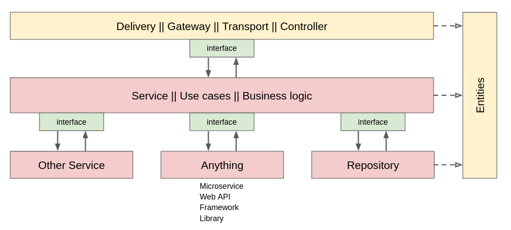

# Ozon Journal

## Запуск

### С использованием `in-memory` хранилища данных
1. Отредактировать поле `storage type` в файле `config/config.yml`, задав ему значение `in-memory`. (дополнительно: если необходимо - имзенить другие настройки)
2. ```make docker-build && docker run -p 8001:8001 ozon_journal:latest```

### С использованием `postgres` хранилища данных
`docker compose up`

>P.S. docker-compose используется для DX. Он позволяет быстро развернуть окружение для разработчика, вместе с необходимым набором third-party. Из-за этого же я не стал использовать .env файл, т.к. существует возможность прокидывать ENV-переменные в docker-compose.yml. Это не какой-то пет-проект, чтобы тут было много коммитов, удалённые базы и т.д., а в проде обычно не используются ни тот, ни другой подход. К тому же, docker-compose позволяет изменять настройки, не производя никаких манипуляций с контейнером. Если Вы будете всё-таки использовать удалённый PostgreSQL, то запускайте контейнер с *-e POSTGRES_DSN=xxx* 

## Структура
`api/graphql` - схема GraphQL

`cmd/app` - начальная точка входа. В себе содержит минимум: создание конфига и запуск приложения с полученным конфигом. В случае ошибки при получении конфига вызывает панику.

`config` - управление конфигурацией приложения.

`internal/app` - пакет управления приложением. В нём связываются слои приложения.

`internal/entity` - пакет глобальных сущностей приложения. В нём находят структуры данных, которые используются в разных слоях приложения. Вдохновлялся [тут](https://youtu.be/hDwqFRUuykQ?si=wBc1P-83Kcm2lDmH&t=924).

`internal/repository` - тут хранятся логика работы с хранилищами данных, а именно: in-memory и postgres. Слой данных.

`internal/controller/graphql` - слой контроллера graphql. Основная задача - обработка запросов и возвращение ответов пользователю. Внутри него также есть пакет model, в котором хранятся сущности graphql.

`internal/service/` - сервисный слой, бизнес логика.

`internal/interfaces.go` - хранение интерфейсов, необходимых для связи слоёв.

`manualTests` - небольшое количество запросов, предназначенных для того, чтобы их можно было вставить в GraphQL Playground для быстрого собственноручного теста.

`migrations` - миграции для базы данных.

`pkg/*` - различные переиспользуемые пакеты. Многие пакеты (все) переиспользованы/адаптированы [отсюда](https://github.com/evrone/go-clean-template/tree/master/pkg).

## Архитектура

